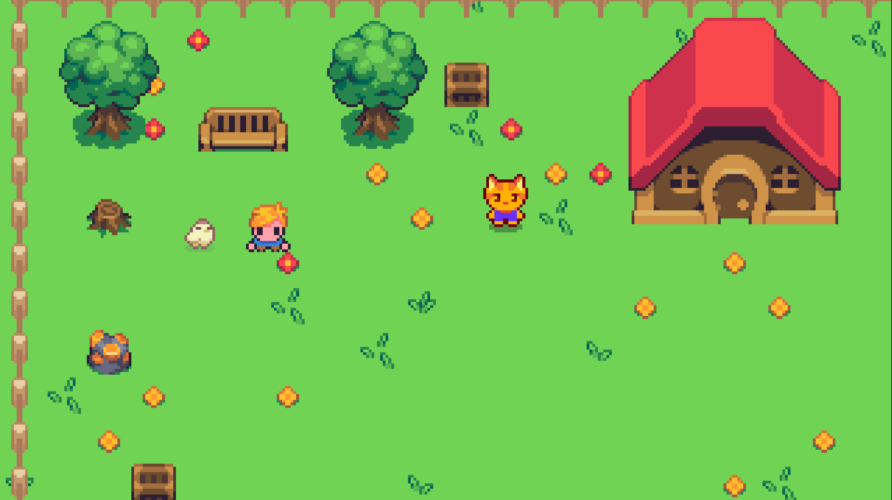

# 🎮 [ZELDA NOOB] - Tutoriel Godot 4

> Un RPG pixel art inspiré de Zelda, créé avec Godot Engine 4.5

https://www.youtube.com/@LysdoraCraft
---

## 📖 À propos

Ce projet accompagne ma série de tutoriels YouTube sur la création d'un RPG rétro avec Godot 4.

**🎯 Ce que tu vas apprendre :**
- Création d'un personnage jouable avec animations
- Système de dialogue avec PNJ
- Gestion d'inventaire et objets
- Combat 
- Cycle jour/nuit
- Sauvegarde/Chargement
- Et bien plus ! ⚔️

---

## 🚀 Comment utiliser ce projet ?

### Prérequis
- **Godot Engine 4.4+** ([Télécharger ici](https://godotengine.org/))
- Envie d'apprendre, pour debutant

